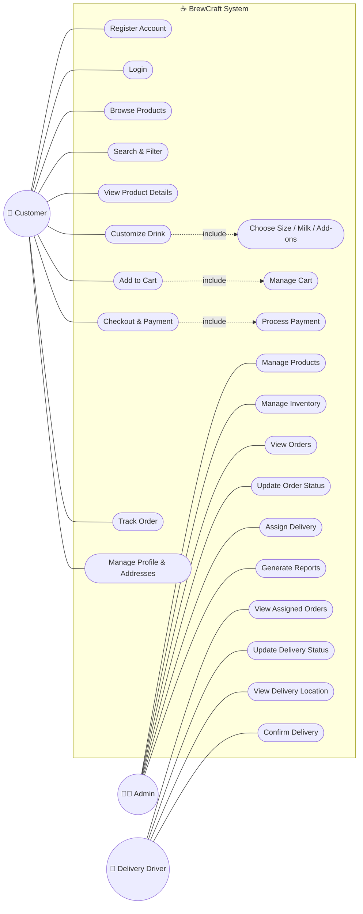

# ☕ BrewCraft – Online Coffee Shop System

## 📌 Project Overview

**BrewCraft** is an Online Coffee Shop System that allows customers to browse coffee products, customize their drinks, add products to the shopping cart, place orders, make payments, and track their orders.

The system also provides an **Admin Dashboard** for managing products, inventory, orders, and deliveries.

---

# 📋 Software Requirements Specification (SRS)

## 1. Introduction

BrewCraft is an online coffee shop system designed to provide customers with an easy and convenient way to order coffee and other products online.

The system supports customers, administrators, and delivery staff.

---

# 2. Functional Requirements

### 👤 Customer

- Register a new account.
- Login to the system.
- Manage profile and addresses.
- Browse coffee products.
- Search and filter products.
- View product details.
- Customize coffee drinks.
- Select size.
- Select milk type.
- Select sweetness level.
- Add extra ingredients.
- Add products to cart.
- View and manage cart.
- Checkout.
- Select delivery address.
- Select payment method.
- Make payment.
- Track order status.

### 👨‍💼 Admin

- Login to the administration system.
- Add products.
- Update products.
- Delete products.
- Manage inventory.
- View customer orders.
- Update order status.
- Manage customers.
- Assign delivery orders.
- Generate reports.

### 🚚 Delivery Driver

- View assigned orders.
- View delivery location.
- Update delivery status.
- Confirm delivery.

---

# 3. Non-Functional Requirements

### 🔐 Security
- Secure user authentication.
- Passwords must be stored securely.
- Secure payment processing.

### ⚡ Performance
- The system should respond quickly under normal conditions.

### 📱 Usability
- Simple and user-friendly interface.
- Responsive design for desktop and mobile devices.

### 🔄 Reliability
- The system should be available and reliable during normal operation.

---

# 4. UML Diagrams

## 4.1 Use Case Diagram

---

## 4.2
